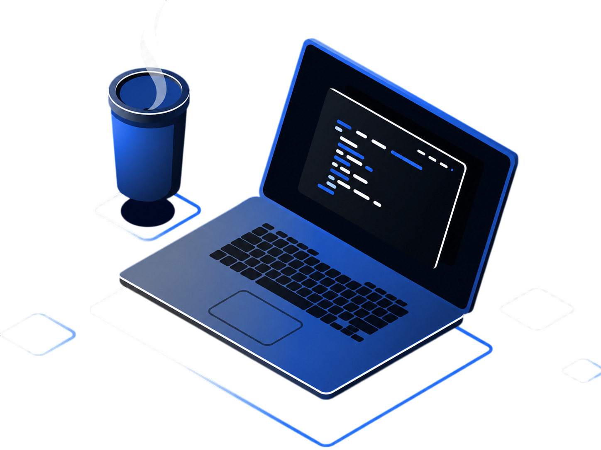

  
  

  

  
4th-semester <b>Software Engineering student at the University of Brasília (UnB)</b>, focused on systems development and automation. I have practical experience in building cloud solutions (AWS), API integration, and applications involving Artificial Intelligence. I enjoy solving complex problems and optimizing processes through clean code and efficient architectures.

  
  
### Languages, Tools and DevOps:

  <a href="https://skillicons.dev">
    
      
    
  </a>

### GitHub Stats:

  <picture>
    <source media="(prefers-color-scheme: dark)" srcset="https://raw.githubusercontent.com/thomas4ugust0/thomas4ugust0/output/github-contribution-grid-snake-dark.svg?v=2">
    <source media="(prefers-color-scheme: light)" srcset="https://raw.githubusercontent.com/thomas4ugust0/thomas4ugust0/output/github-contribution-grid-snake.svg?v=2">
    
  </picture>

  
  
  
  

### Contact:

  
  
  

