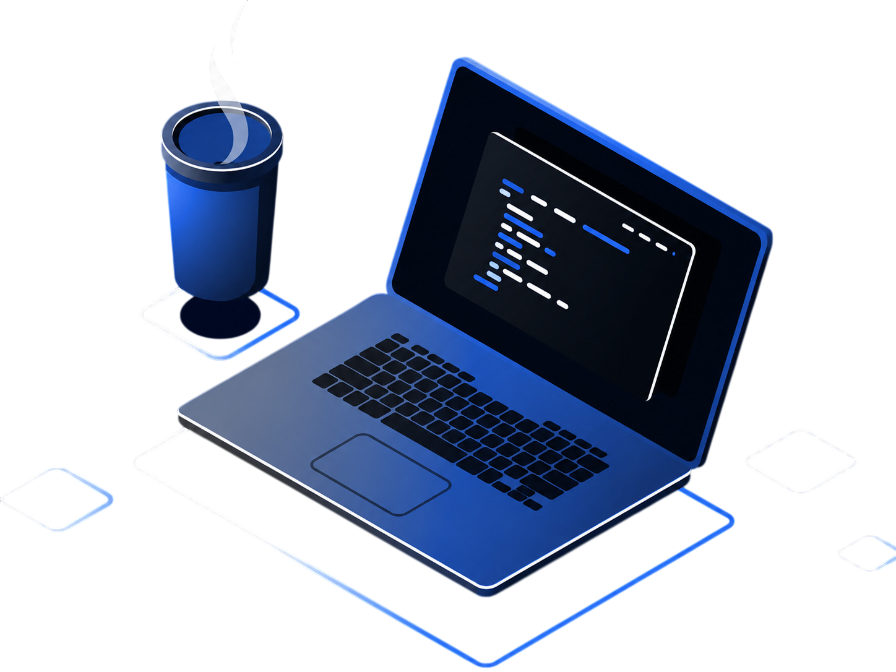

  
  
  <h2>Olá, eu sou o Thomas! </h2>
  
Estudante do 4° semestre de Engenharia de Software na Universidade de Brasília, focado em desenvolvimento de sistemas e automação. Possuo experiência prática na criação de soluções em nuvem (AWS), integração de APIs e aplicações em Inteligência Artificial.

### Linguagens e Ferramentas

### DevOps

 

### Contatos

